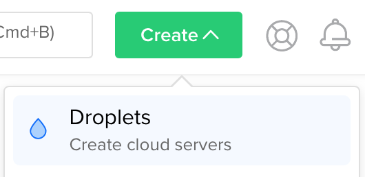

# Requirements
- Digital Ocean account ([sign up](https://m.do.co/c/94e5e51e1a59))
- A terminal (iTerm2 is best)

# Summary
In this lesson, we'll create an SSH key pair, an instance (droplet), a user on the instance and grant it permissions to use `sudo`.

This guide assumes you'll be using a Mac to run the commands described. Adjust accordingly.

1. Create SSH key (optional)
2. Create a droplet
3. Log into droplet
4. Create user
4. Update packages

# Steps

## Create SSH key (optional)
If you already have an SSH key you want to use, skip this step.

Open a new terminal window and type:

```sh
ssh-keygen -t rsa -b 4096 -f batman
```

Two new files will be created locally in the current folder, named `batman` and
`batman.pub` (private and public keys, respectively). We'll need to keep the private key safe, so change the permissions on it:

```sh
chmod 0600 batman
```

**Note**: we're using `batman` as the key name here, but you can use any string as an identifier.

## Create droplet
Log into the [Digital Ocean dashboard](https://cloud.digitalocean.com) and click the _Create_ button, then select _Droplets_.



By default, the dashboard will have _Ubuntu 16.04.4 x64_ selected (or similar). Select the smallest droplet size from the _Standard Droplets_ table, then scroll down to _Choose a datacenter region_ and select the one geographically closest to you.

Under _Add your SSH keys_, click _New SSH Key_ and paste the contents of the **public** key you created earlier, `batman.pub`. Give it a meaningful name and click _Add SSH Key_.

You can leave the number of droplets and the hostname fields at their defaults.

Finally, press _Create_ at the bottom of the page.

## Log into droplet
From the [droplets list](https://cloud.digitalocean.com/droplets), find your droplet (if this is the first droplet in your Digital Ocean account, it should be easy 😉) and click on the IP address to copy it.

Then switch back to your terminal window and log into it as `root`:

```sh
ssh -i batman root@128.199.185.242 # your IP will differ from this
```
- `-i` is the flag used to specify a different key file to the SSH client (it defaults to `~/.ssh/id_rsa`)
- `root` is the super user account that is created by default on the system

On first connection, you'll be asked to confirm the fingerprint of the server, with a message similar to this:

```
The authenticity of host '128.199.185.242 (128.199.185.242)' can't be established.
ECDSA key fingerprint is SHA256:T5iBM4J6EnW0hGXwc+H4KWXQwyY2Vgg3OoAKrf3WJpM.
Are you sure you want to continue connecting (yes/no)?
```

Simply type `yes` and press _[ENTER]_ to connect.

You are now connected to your own droplet.

## Create user
While connected as `root`, let's create an _unprivileged_ user named `batman`, and grant it access to _becoming_ privileged by way of using `sudo`.

To create the user, run the command below and fill in the blanks:

```sh
adduser batman
```

You'll then be prompted to set a password for this user, and fill in the account details (or just press _[ENTER]_ to accept defaults):

```
Adding user `batman' ...
Adding new group `batman' (1000) ...
Adding new user `batman' (1000) with group `batman' ...
Creating home directory `/home/batman' ...
Copying files from `/etc/skel' ...
Enter new UNIX password: ******
Retype new UNIX password: ******
passwd: password updated successfully
Changing the user information for batman
Enter the new value, or press ENTER for the default
	Full Name []:
	Room Number []:
	Work Phone []:
	Home Phone []:
	Other []:
Is the information correct? [Y/n]
```

Now we need to add our SSH key to this user's home folder so we can SSH into this
instance as `batman` and stop using `root` (it is generally recommended to avoid
the super user accounts when doing most work on servers, and only _assume_ the
super user role when needed).

Change into the `batman` user with `su`:

```sh
su - batman
```

You'll notice your prompt has changed. Now create a new folder and add your
public key to it:

```sh
mkdir ~/.ssh
cat > ~/.ssh/authorized_keys <EOF
--PASTE YOUR PUBLIC KEY CONTENTS HERE AND PRESS ENTER--
EOF
```

To confirm our public key is correct, the command below should print it out
again:

```sh
cat ~/.ssh/authorized_keys
```

Update the permissions so the SSH server can use it:

```sh
chmod 0600 ~/.ssh/authorized_keys
```

Finally, let's grant our user permission to _assume_ super user privileges when
needed. For that, log out of the `batman` session by typing `exit`.

Then add the user to the `sudo` group:

```sh
adduser batman sudo
```

To verify we can use `sudo`, open a new terminal window and connect with SSH again, but this time using the `batman` user:

```sh
ssh -i batman batman@128.199.185.242
```

Then type `sudo whoami`. You'll be prompted for our user's password and then it
should print the word `root`, indicating you have super user privileges when using `sudo`, as shown below:

```
$ sudo whoami
[sudo] password for batman: ******
root
```

If that worked, you can now close the first terminal session we opened to the droplet.

## Update packages
While connected as our unprivileged user to the droplet, let's update the
packages installed by default on our system.

We'll use a tool called `apt` for this.

First we'll update the _catalog_ of packages, so that it contains the most
 current versions of all software available.

```sh
sudo apt update
```

You'll see an output similar to this (abbreviated):

```
Hit:1 http://sgp1.mirrors.digitalocean.com/ubuntu xenial InRelease
Get:2 http://security.ubuntu.com/ubuntu xenial-security InRelease [107 kB]
Get:3 http://sgp1.mirrors.digitalocean.com/ubuntu xenial-updates InRelease [109 kB]
Get:4 http://sgp1.mirrors.digitalocean.com/ubuntu xenial-backports InRelease [107 kB]
Get:5 http://sgp1.mirrors.digitalocean.com/ubuntu xenial/main Sources [868 kB]
...
Translation-en [3,996 B]
Fetched 25.3 MB in 7s (3,453 kB/s)
Reading package lists... Done
Building dependency tree
Reading state information... Done
29 packages can be upgraded. Run 'apt list --upgradable' to see them.
```

The number of packages may vary, but if it's above 0, we should apply upgrades with:

```sh
sudo apt dist-upgrade
```

You'll be prompted to confirm the operation after a list of changes is displayed:

```
Reading package lists... Done
Building dependency tree
Reading state information... Done
Calculating upgrade... Done
The following package was automatically installed and is no longer required:
  grub-pc-bin
Use 'sudo apt autoremove' to remove it.
The following NEW packages will be installed:
  linux-headers-4.4.0-128 linux-headers-4.4.0-128-generic linux-image-4.4.0-128-generic
The following packages will be upgraded:
  apport console-setup console-setup-linux git git-man gnupg gpgv ifupdown keyboard-configuration libelf1 libldap-2.4-2 libperl5.22 libplymouth4 libprocps4 linux-headers-generic linux-headers-virtual
  linux-image-virtual linux-virtual perl perl-base perl-modules-5.22 plymouth plymouth-theme-ubuntu-text procps python3-apport python3-problem-report snapd ubuntu-core-launcher vlan
29 upgraded, 3 newly installed, 0 to remove and 0 not upgraded.
Need to get 61.4 MB of archives.
After this operation, 147 MB of additional disk space will be used.
Do you want to continue? [Y/n]
```

Finally, pressing _[ENTER]_ continues with the operation and the system packages are upgraded. 🎉

**Note**: during package upgrades, sometimes you may be prompted to deal with
configuration conflicts. If you get such prompts, always choose _keep the local
version currently installed_.
